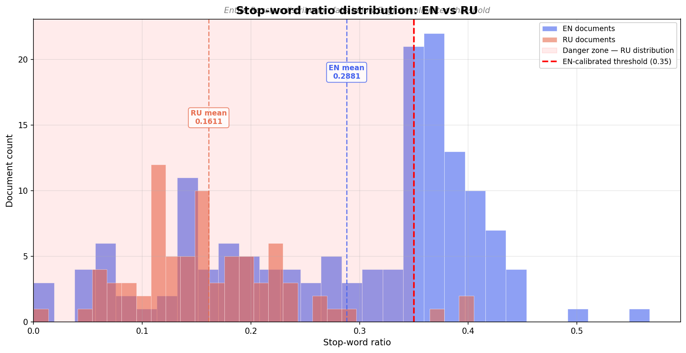
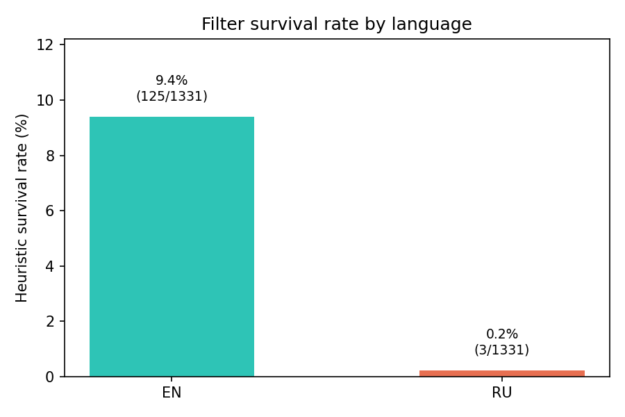
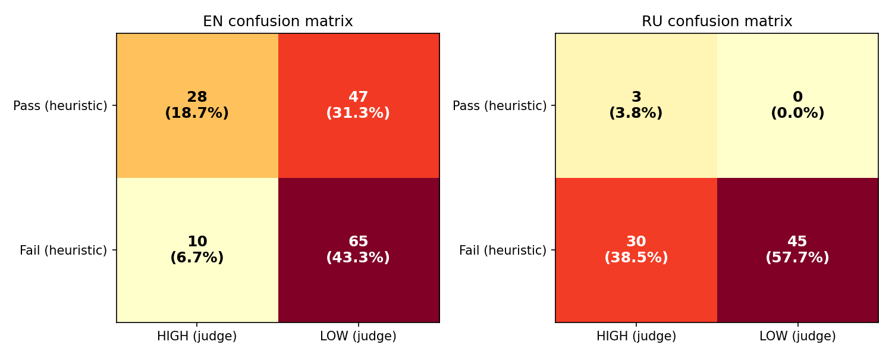
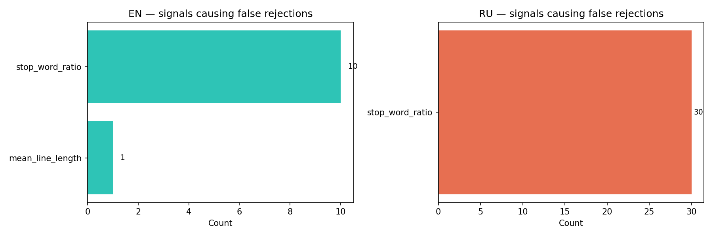

# Terminus

Multilingual web corpus quality pipeline — quantifying how English-calibrated heuristics systematically discard high-quality Russian pre-training data.


> Multilingual web corpus curation for pre-training.
> *The foundation of every great model is the data it was trained on.*
> nlp, pre-training, data-quality, common-crawl, mutlilingual.
---

## The problem

Pre-training pipelines filter web text through heuristic quality signals before data reaches a training run. Most of these signals -- stop-word ratio, punctuation density, mean word length -- were calibrated on English CommonCrawl data. When applied unchanged to other languages, they systematically discard content that isn't actually low quality. It just isn't English-shaped. 
Same argument can be made about English-calibrated tokenizers.

Terminus quantifies this gap for Russian, identifies the specific signal responsible, and validates the finding with an LLM quality judge.

---

## Findings

I ran a 7-stage pipeline on a single CommonCrawl WET segment (CC-MAIN-2026-12), applying identical English-calibrated heuristic filters to EN and RU documents sampled from the same crawl, then scoring all 2,610 post-dedup documents with an LLM quality judge and validating with a second independent judge.

| Metric | EN | RU |
| --- | --- | --- |
| Documents after dedup | 1,299 | 1,311 |
| Heuristic survival rate | 9.5% (124/1,299) | 0.2% (3/1,311) |
| False rejection rate (Gemini judge) | 12.7% (149/1,175) | 16.3% (213/1,308) |
| Stop-word ratio failures | 98.6% of rejections | 99.9% of rejections |

**The headline numbers:**

- **42x survival gap.** Under identical thresholds, English documents survive at 9.5%, Russian at 0.2%.
- **1.3x false rejection gap.** 16.3% of rejected Russian documents are rated HIGH quality by the judge, vs 12.7% for English. That gap is modest in rate but massive in absolute terms: 213 good Russian documents discarded per segment.
- **One signal causes it all.** 99.9% of Russian rejections trace to a single threshold: `stop_word_ratio >= 0.35`.
- **Categorically unreachable.** The Russian stop-word ratio distribution peaks well below 0.35 (mean: 0.1521). No Russian document can reliably pass this threshold regardless of quality.
- **Estimated impact.** 213 high-quality Russian documents discarded per WET segment. Across the full CC-MAIN-2026-12 crawl (94,000+ segments), this scales to ~20M documents.

**Why this happens:** Russian is morphologically rich -- nouns, verbs, and adjectives inflect across case, gender, and number. This means grammatical relationships that English expresses with separate function words (prepositions, articles, auxiliaries) are encoded inside word endings in Russian. A whitespace-split stop-word lookup misses most of them. A well-written Russian document scores 0.10-0.25 on stop-word ratio; the English-calibrated threshold is 0.35. There is almost no overlap.



---

## Methodology

### Why stratified sampling

The naive approach -- run the judge on everything -- obscures what you actually want to measure. Instead, documents are divided into four quadrants after heuristic filtering:

```
                      heuristic_pass=True    heuristic_pass=False
lang=EN               Quadrant A             Quadrant B
lang=RU               Quadrant C             Quadrant D
```

Sampling equally from each quadrant (75 per quadrant) ensures the judge evaluates documents the filter accepted AND rejected, for both languages. This makes the false rejection rate directly measurable: it is the fraction of Quadrant D documents (filter rejected) that the judge rates HIGH quality.

Quadrant C -- Russian documents that passed heuristics -- had only 3 documents out of 1,311 (post-dedup). That asymmetry alone tells the story.

EN and RU document counts were balanced at the language filter stage (step 2), ensuring the survival gap reflects filter behavior, not input composition.

### Judge design

The judge scores each document as HIGH or LOW quality using a deliberately language-agnostic rubric. The key design constraint: quality criteria must not reference English or assume any specific linguistic structure.

**Primary model:** `google/gemini-3.1-flash-lite-preview` via OpenRouter. Strong multilingual capability, cost-efficient (~$0.01 per 300 documents).

**System prompt:**

```
You are a data quality judge for multilingual LLM pre-training corpora.

Rate HIGH if: written by a human with coherent intent, contains real 
information or argument a reader would find useful, consistent grammar 
and natural sentence flow for its language, found on a legitimate website.

Rate LOW if: spam, SEO keyword stuffing, boilerplate (cookie notices, 
nav menus, legal disclaimers), garbled or machine-translated text, 
primarily lists of links or product codes without prose.

IMPORTANT: Do not penalize text for topic, register, or language.
A well-written Russian forum post is HIGH quality.
A poorly written English blog is LOW quality.

Respond with JSON only:
{"quality": "HIGH"|"LOW", "confidence": 0.0-1.0, 
 "reason": "one sentence", "primary_signal": "what drove the decision"}
```

Each document is truncated to its first 400 tokens for the judge -- quality signal is dense in the opening and cost is proportional to length.

### Inter-judge validation

To check whether the finding is judge-dependent, the same 228-document sample was scored independently by `meta-llama/llama-3.1-8b-instruct`. Results:

| Metric | Gemini 3.1 Flash Lite | Llama 3.1 8B |
| --- | --- | --- |
| Overall HIGH rate | 23.7% | 31.1% |
| EN false rejection rate | 10.7% | 13.3% |
| RU false rejection rate | 14.7% | 40.0% |

The directional finding -- RU false rejection rate significantly exceeds EN -- holds under both judges. Gemini is the stricter judge overall (23.7% vs 31.1% HIGH) but the gap between EN and RU is consistent. The 20.6% disagreement rate (47 documents) concentrates in documents where Llama rates HIGH and Gemini rates LOW, consistent with Llama being more permissive on borderline Russian text it may not fully comprehend.

The conservative estimate (Gemini) is used as the primary result.

---

## Results








---

## Pipeline

```
WET file (60MB compressed, ~20k documents)
    |
    v
[1. Ingest]             warcio parse -> JSONL (id, url, lang_cc, text, char_count)
    |
    v
[2. Language filter]    FastText LID (lid.176.bin) -> keep EN + RU, balance sizes
    |
    v
[3. Heuristics]         10 signals as floats, threshold from config, log failed_signals
    |
    v
[4. Dedup]              MinHash LSH per language (128 perms, 0.7 threshold, 5-grams)
    |
    v
[5. Sample/Full]        stratified 300-doc sample OR full corpus judge run
    |
    v
[6. LLM judge]          OpenRouter (Gemini primary), JSON output per document
    |
    v
[7. Report]             Confusion matrix, survival rates, false rejection rate, charts
```

Each stage reads from and writes to JSONL in the output directory. Stages are independently re-runnable -- if the judge fails partway through, resume from the sampled file without reprocessing the full corpus.

---

## Heuristics

All signals are computed as floats and preserved in the output. Thresholds are applied in a separate pass so the raw scores are always available for analysis. Each rejected document records which signal caused the rejection in a `failed_signals` field.

| Signal | Description | Threshold | Cross-lingual note |
| --- | --- | --- | --- |
| char_count | Total characters | 200-100,000 | None |
| word_count | Whitespace-split tokens | min 30 | Minor |
| mean_word_length | Avg chars per word | 3.0-12.0 | Russian words are longer |
| punct_ratio | Punctuation / total chars | max 0.15 | Russian guillemets counted differently |
| digit_ratio | Digits / total chars | max 0.2 | None |
| uppercase_ratio | Uppercase / total chars | max 0.2 | None |
| **stop_word_ratio** | **Stop words / total words** | **min 0.35** | **Primary failure mode for Russian** |
| mean_line_length | Avg chars per line | min 20 | None |
| bullet_ratio | Lines starting with bullets | max 0.5 | None |
| ellipsis_ratio | Ellipsis patterns per 1k chars | unthresholded | None |

The `stop_word_ratio` threshold of 0.35 is the English-calibrated value used in standard pipelines such as C4 and RefinedWeb. It is intentionally left unchanged to expose the bias.

---

## Quick start

```bash
git clone https://github.com/kiborisov/terminus.git
cd terminus
pip install -e .
```

Get a WET segment URL from `https://data.commoncrawl.org/crawl-data/CC-MAIN-2026-12/wet.paths.gz` and download it:

```bash
curl -L "https://data.commoncrawl.org/crawl-data/CC-MAIN-2026-12/<segment>.wet.gz" \
  -o sample.wet.gz
```

Set your OpenRouter API key:

```bash
cp .env.example .env
# Add OPENROUTER_API_KEY to .env
```

Test the judge on 5 documents first:

```bash
terminus run --wet-url ./sample.wet.gz --output ./results/test --dry-run --test
```

Run the full pipeline:

```bash
terminus run \
  --wet-url ./sample.wet.gz \
  --languages en,ru \
  --sample-size 10000 \
  --output ./results/run-001
```

---

## Limitations

- **Single WET segment.** 60MB of 5.63TiB total. Results should be validated across more segments before drawing corpus-level conclusions.
- **Judge coverage.** Initial stratified sample of 228 documents (75 per quadrant), validated by a full-corpus run on all 2,610 post-dedup documents. Quadrant C (RU, passed heuristics) had only 3 documents -- the asymmetry is real but limits precision on that cell.
- **No human rater baseline.** Judge quality is validated through inter-model agreement (79.4%), not against human annotations.
- **Single language pair.** EN/RU only. The same mechanism likely applies to Turkish, Finnish, Arabic, and other morphologically rich languages -- untested here.
- **No boilerplate pre-stripping.** WET extraction includes navigation, footers, and menus. A production pipeline would strip these before quality filtering.

---

## From prototype to production

Terminus processes one WET segment as a proof of concept. The methodology scales -- the engineering does not, without changes.

**What scales directly:**
- All quality signals are stateless and trivially parallelisable across workers
- Stratified sampling for judge calibration works the same at any corpus size
- The core finding holds: per-language threshold calibration is necessary regardless of scale

**What changes at scale:**
- Ingest runs distributed across hundreds of workers (Spark, Ray) rather than sequentially
- Deduplication requires a global index across the full corpus -- per-segment MinHash misses cross-segment duplicates at PB scale
- LLM judge is used for calibration samples only, not every document -- bulk filtering uses trained classifiers (fastText, small BERT) calibrated against judge labels
- Quality monitoring becomes continuous -- signal distributions are tracked across every new crawl, with alerts on drift

**The methodology stays constant.** At any scale, the question is the same: are your quality signals valid across languages? Terminus provides a repeatable framework for finding and quantifying calibration gaps.

---

## Roadmap

- **Scale validation.** Run across multiple CC-MAIN-2026-12 segments to confirm false rejection rates at corpus scale.
- **Language-aware thresholds.** Per-language stop-word lists and calibrated threshold offsets -- the proposed fix is a config change, not a pipeline rewrite.
- **More language pairs.** Turkish, Finnish, Arabic, Hindi, Japanese -- typologically diverse to test generality.
- **Human validation.** Annotate 200+ documents to establish a ground truth baseline for judge calibration.
- **Tessera.** Release as an open-source multilingual data quality toolkit with pluggable filters, language-aware defaults, and built-in calibration tooling.

---

Built with CommonCrawl data. Judge powered by Gemini and Llama via OpenRouter.
